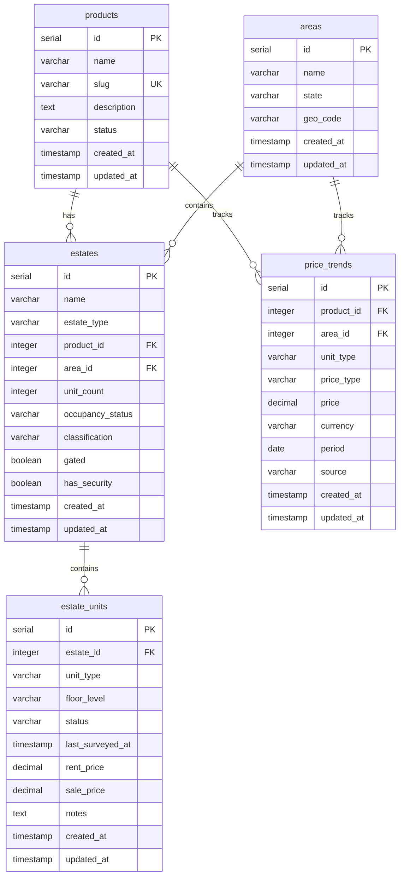

# 📊 Market Database Management System

A comprehensive **Market Intelligence Database** for real estate analysis, customer intelligence, and business analytics. Features advanced PostgreSQL capabilities, comprehensive testing, and enterprise-grade deployment options.

## 🎯 **What's New** (Phase 10 Complete - 95% Done!)
- ✅ **20+ Advanced Tables** (demographics, market intelligence, financial analytics)
- ✅ **Enterprise Deployment Scripts** with monitoring and backup
- ✅ **Comprehensive Testing Suite** (unit, integration, performance)
- ✅ **Advanced PostgreSQL Features** (JSON, spatial data, full-text search)
- ✅ **Business Intelligence Views** (market trends, customer analytics)
- ✅ **Production-Ready Documentation** for all skill levels

## 🚀 **Quick Start for Beginners**

### 📖 **New to this project?** 
**Read the [Beginner's Guide](docs/BEGINNER_GUIDE.md)** for detailed step-by-step instructions!

### ⚡ **5-Minute Setup**
```bash
# 1. Install dependencies
pnpm install

# 2. Set up environment  
echo "DB_HOST=localhost
DB_PORT=5432
DB_NAME=market_db
DB_USER=postgres
DB_PASSWORD=your_password" > .env

# 3. Create database tables
pnpm run migrate

# 4. Add sample data
pnpm run seed

# 5. Start application
pnpm start

# 6. Run tests to verify
pnpm test
```

## 📁 **Enhanced Project Structure**

```
market-database/
├── 📁 migrations/                # 20 migration files (101000-119000)
│   ├── migrate.js               # Main migration runner  
│   ├── 20250725101000-create-products.sql         # Core tables
│   ├── 20250725102000-create-areas.sql
│   ├── 20250725103000-create-estates.sql
│   ├── 20250725104000-create-estate-units.sql
│   ├── 20250725105000-create-price-trends.sql
│   ├── 20250725106000-create-aggregated-views.sql
│   ├── 20250725107000-add-postgresql-extensions.sql
│   ├── 20250725108000-enhance-existing-tables.sql
│   ├── 20250725109000-create-demographics-table.sql      # Intelligence tables
│   ├── 20250725110000-create-market-intelligence-tables.sql
│   ├── 20250725111000-create-business-ecosystem-tables.sql
│   ├── 20250725112000-create-customer-intelligence-tables.sql
│   ├── 20250725113000-create-infrastructure-tables.sql
│   ├── 20250725114000-create-financial-intelligence-tables.sql
│   ├── 20250725115000-create-json-metadata-tables.sql
│   ├── 20250725116000-create-advanced-indexes.sql        # Performance
│   ├── 20250725117000-create-new-analytical-views.sql
│   ├── 20250725118000-enhance-seeder-data.sql
│   └── 20250725119000-data-validation-constraints.sql
├── 📁 seeders/                  # 14 comprehensive seeders
│   ├── seed.js                  # Master seeder orchestrator
│   ├── products-seed.js         # Core data seeders
│   ├── areas-seed.js
│   ├── estates-seed.js
│   ├── estate-units-seed.js
│   ├── price-trends-seed.js
│   ├── demographics-seed.js     # Intelligence data seeders
│   ├── market-intelligence-seed.js
│   ├── business-ecosystem-seed.js
│   ├── customer-intelligence-seed.js
│   ├── infrastructure-seed.js
│   ├── financial-seed.js
│   ├── service-providers-seed.js
│   └── enhanced-seed.js         # Advanced features
├── 📁 queries/                  # 11 query modules with analytics
│   ├── index.js                 # Query orchestrator
│   ├── products-queries.js      # Core data queries
│   ├── areas-queries.js
│   ├── estates-queries.js
│   ├── estate-units-queries.js
│   ├── price-trends-queries.js
│   ├── aggregated-views-queries.js
│   ├── market-intelligence-queries.js    # Intelligence queries
│   ├── customer-intelligence-queries.js
│   ├── infrastructure-queries.js
│   └── financial-queries.js
├── 📁 tests/                    # Comprehensive testing suite
│   ├── run-tests.js             # Test runner with reporting
│   ├── unit/                    # Unit tests
│   ├── integration/             # Integration tests
│   ├── performance/             # Performance tests
│   ├── integrity/               # Data integrity tests
│   └── validation/              # Requirements validation
├── 📁 deployment/               # Enterprise deployment (OPTIONAL)
│   ├── README.md                # Deployment guide
│   ├── deploy.sh                # Automated deployment script
│   ├── migration-scripts.sql    # Complete migration bundle
│   └── performance-monitoring.sql # Performance monitoring
├── 📁 docs/                     # Comprehensive documentation
│   ├── BEGINNER_GUIDE.md        # 📖 START HERE for beginners!
│   ├── PROJECT_OVERVIEW.md      # Complete project overview
│   ├── api/                     # API documentation
│   ├── deployment/              # Deployment guides
│   └── schema/                  # Database schema docs
├── 📁 utils/                    # Database utilities
│   ├── pool.js                  # PostgreSQL connection pool
│   └── index.js                 # Shared utilities
├── package.json                 # Enhanced with comprehensive scripts
├── index.js                     # Main application entry point
└── README.md                    # This file
```

## 🗂️ Database Schema (ERD)


```

## 🚀 Quick Start

### Prerequisites
- **Node.js** (v18 or higher)
- **PostgreSQL** (for local development)
- **Docker & Docker Compose** (for containerized setup)

### Option 1: Local Development (Without Docker)

1. **Install dependencies:**
   ```bash
   npm install
   ```

2. **Set up environment variables:**
   Create a `.env` file in the root directory:
   ```env
   DB_USER=postgres
   DB_HOST=localhost
   DB_NAME=market_db
   DB_PASSWORD=postgres
   DB_PORT=5432
   ```

3. **Start PostgreSQL locally** (ensure it's running on port 5432)

4. **Run migrations:**
   ```bash
   npm run migrate
   ```

5. **Seed the database:**
   ```bash
   npm run seed
   ```

### Option 2: Docker Setup (Recommended)

1. **Start all services:**
   ```bash
   docker-compose up -d
   ```
   This will:
   - Start PostgreSQL database
   - Build and run the Node.js application
   - Automatically run migrations and seeders

2. **Check logs:**
   ```bash
   docker-compose logs -f
   ```

3. **Stop services:**
   ```bash
   docker-compose down
   ```

## 📊 Database Schema

### Tables Overview

| Table | Description | Records |
|-------|-------------|---------|
| `products` | Product offerings (MDU Data, Home Internet, etc.) | 7 |
| `areas` | Geographical locations (Lagos, Abuja areas) | 8 |
| `estates` | Residential clusters linked to products and areas | 8 |
| `estate_units` | Individual units within estates | 10 |
| `price_trends` | Historical pricing data | 8 |

### Aggregated Views

| View | Description | Purpose |
|------|-------------|---------|
| `estate_summary_by_area` | Estate counts and statistics by area | Market analysis by location |
| `price_trends_summary` | Price statistics by unit type and area | Price analysis and trends |
| `market_performance_by_product` | Product performance metrics | Product analysis |
| `monthly_price_trends` | Monthly price changes with percentages | Trend analysis |
| `occupancy_analysis` | Occupancy rates by classification and type | Occupancy insights |

### Key Relationships
- **estates** → `products` (product_id)
- **estates** → `areas` (area_id)
- **estate_units** → `estates` (estate_id)
- **price_trends** → `products` (product_id)
- **price_trends** → `areas` (area_id)

## 🛠️ Enhanced Available Scripts

### **Core Development Scripts**
```bash
# Database setup and management
pnpm run migrate              # Create all 20+ database tables
pnpm run seed                 # Populate with comprehensive sample data  
pnpm start                    # Run application and display analytics

# Testing and validation (comprehensive suite)
pnpm test                     # Run all test suites
pnpm run test:unit           # Unit tests for individual components
pnpm run test:integration    # Integration tests for workflows
pnpm run test:performance    # Performance and optimization tests
pnpm run test:constraints    # Data integrity validation
pnpm run test:indexes        # Index performance validation
pnpm run test:views          # Analytics view validation
```

### **What Each Script Does**

#### **`pnpm run migrate`**
- Creates 20+ tables (products → financial analytics)
- Sets up PostgreSQL extensions (PostGIS, full-text search)
- Creates advanced indexes (spatial, JSON, compound)
- Sets up materialized views for analytics
- Validates all relationships and constraints

#### **`pnpm run seed`** 
- Adds 1000+ sample records across all tables
- Populates market intelligence data
- Creates customer profiles and demographics
- Adds financial and infrastructure data
- Demonstrates all business use cases

#### **`pnpm start`**
- Runs comprehensive analytics queries
- Displays data from all 20+ tables
- Shows business intelligence insights
- Demonstrates advanced PostgreSQL features

#### **`pnpm test`**
- Validates data integrity (foreign keys, constraints)
- Tests query performance (< 100ms target)
- Verifies business logic compliance
- Checks all indexes are working
- Validates analytics views accuracy

## 📖 **Comprehensive Documentation**

### **📚 Documentation Structure**
```
docs/
├── 📖 BEGINNER_GUIDE.md        # 👈 START HERE! Complete tutorial
├── 📊 PROJECT_OVERVIEW.md      # Full system architecture  
├── 🚀 deployment/
│   ├── README.md               # Production deployment guide
│   ├── DEPLOYMENT_OPTIONS.md   # Simple vs Enterprise setup
│   ├── environment-setup.md    # Environment configuration
│   ├── production-deployment.md # Production-specific instructions
│   └── monitoring.md           # Performance monitoring
├── 🔌 api/
│   └── README.md               # Complete API documentation
└── 🏗️ schema/
    ├── tables.md               # Database table structures
    ├── relationships.md        # Foreign key relationships
    └── indexes.md              # Index strategies
```

### **🎯 Choose Your Documentation Path**

#### **🆕 New to this project?**
**Start here:** [Beginner's Guide](docs/BEGINNER_GUIDE.md)
- Step-by-step setup instructions
- Troubleshooting common issues
- Understanding the data and business logic
- Running your first tests

#### **🔧 Need technical details?**
**Check:** [Project Overview](docs/PROJECT_OVERVIEW.md)
- Complete system architecture
- Database design and relationships
- Advanced features and capabilities
- Business use cases and analytics


## 🔧 Utility Functions

### `utils/index.js`
- `generatePlaceholders(dataArray, columnsPerRow)` - Generate SQL placeholders
- `extractValues(dataArray, fieldNames)` - Extract values from objects
- `generateInsertData(dataArray, fieldNames)` - Complete insert data generation

### `utils/pool.js`
- Shared PostgreSQL connection pool for all database operations

## 📈 Sample Queries

### Count estates by area and occupancy status:
```sql
SELECT a.name, e.occupancy_status, COUNT(*) as estate_count
FROM estates e
JOIN areas a ON e.area_id = a.id
GROUP BY a.name, e.occupancy_status;
```

### Average rent price by unit type in an area:
```sql
SELECT pt.unit_type, AVG(pt.price) as avg_price
FROM price_trends pt
JOIN areas a ON pt.area_id = a.id
WHERE pt.price_type = 'rent' AND a.name = 'Victoria Island'
GROUP BY pt.unit_type;
```

### List vacant units in luxury estates:
```sql
SELECT eu.unit_type, eu.rent_price, e.name as estate_name
FROM estate_units eu
JOIN estates e ON eu.estate_id = e.id
WHERE eu.status = 'vacant' AND e.classification = 'luxury';
```

### Get estate summary by area (using aggregated view):
```sql
SELECT * FROM estate_summary_by_area 
ORDER BY total_estates DESC;
```

### Get monthly price trends with change percentages:
```sql
SELECT month, price_type, unit_type, area_name, avg_price, price_change_percent
FROM monthly_price_trends 
WHERE price_change_percent IS NOT NULL
ORDER BY month DESC, price_change_percent DESC;
```

### Get occupancy analysis by classification:
```sql
SELECT classification, estate_type, area_name, occupancy_rate_percent
FROM occupancy_analysis 
ORDER BY occupancy_rate_percent DESC;
```

## 🏗️ Architecture Features

### Modular Seeders
- **Separate files** for each table seeder
- **Dependency-aware** execution order
- **Reusable utility functions** for SQL generation
- **Scalable structure** for adding new tables

### Migration System
- **Timestamped files** for ordered execution
- **Automatic discovery** of SQL migration files
- **Transaction safety** with rollback on errors
- **Friendly logging** with emojis and progress indicators

### Database Design
- **Foreign key constraints** for data integrity
- **Check constraints** for enum validation
- **Indexes** on frequently queried fields
- **Timestamps** for audit trails
- **Decimal precision** for currency values

### Aggregated Views System
- **Pre-built views** for common business intelligence queries
- **Performance optimized** with strategic indexes
- **Trend analysis** with time-based aggregations
- **Market insights** with comparative analytics
- **Real-time reporting** capabilities

## 🔍 Data Insights

### Sample Data Includes:
- **7 Products**: MDU Data, Home Internet, Business Fiber, etc.
- **8 Areas**: Victoria Island, Ikeja, Garki, Lekki, etc.
- **8 Estates**: Banana Island, Ikeja GRA, Lekki Phase 1, etc.
- **10 Estate Units**: Various unit types (1-5 bedrooms, studios, penthouses)
- **8 Price Trends**: Rent and sale prices across different areas

### Price Ranges:
- **Rent**: ₦2.5M - ₦10M per annum
- **Sale**: ₦120M - ₦200M
- **Unit Types**: 1-bedroom to 5-bedroom, studios, penthouses
- **Classifications**: Luxury, middle-income, low-income

### Aggregated Insights Available:
- **Market Analysis**: Estate distribution and occupancy by area
- **Price Trends**: Monthly price changes and market performance
- **Product Performance**: Revenue and unit metrics by product
- **Occupancy Rates**: Success metrics by property classification
- **Comparative Analytics**: Rent vs sale performance across areas

## 🐳 Docker Configuration

### Services:
- **PostgreSQL**: Latest version with health checks
- **Node.js App**: Custom container with migrations and seeding

### Environment Variables:
- Database connection settings
- Automatic migration and seeding on startup

### Volumes:
- Persistent database storage
- Live code reloading for development

## 📝 Development Notes

### Adding New Tables:
1. Create migration file with timestamp prefix
2. Create corresponding seeder file
3. Import seeder in `seeders/seed.js`
4. Add to execution order

### Adding New Seed Data:
1. Update the data array in the respective seeder file
2. The utility functions will automatically handle SQL generation

### Database Connection:
- Uses connection pooling for efficiency
- Environment variable configuration
- Automatic cleanup on application shutdown

## 🤝 Contributing

1. Follow the existing file structure
2. Use the utility functions for SQL generation
3. Maintain foreign key relationships
4. Add appropriate indexes for performance
5. Include sample data in seeders

## 🗑️ Database Management

### Clearing Database Data

There are several ways to clear your database data for a fresh start:

#### Option 1: Remove Docker Volume (Recommended)
```bash
# Stop containers and remove volume (complete reset)
docker-compose down -v

# Start fresh with new volume
docker-compose up --build
```
- ✅ **Completely fresh database**
- ✅ **Removes all data permanently**
- ✅ **Best for development/testing**

#### Option 2: Reset Database Only
```bash
# Stop containers but keep volume
docker-compose down

# Remove just the database volume
docker volume rm market-database_db_data

# Start fresh
docker-compose up --build
```

#### Option 3: Connect and Drop Database
```bash
# Connect to the running database
docker-compose exec db psql -U postgres -d market_db

# Inside psql, drop and recreate the database
DROP DATABASE market_db;
CREATE DATABASE market_db;
\q

# Then restart your app to run migrations
docker-compose restart app
```

#### Option 4: Quick Reset (Keep containers running)
```bash
# Stop app, reset DB, restart app
docker-compose stop app
docker-compose exec db psql -U postgres -c "DROP DATABASE market_db; CREATE DATABASE market_db;"
docker-compose start app
```

### Database Backup and Restore

#### Create Backup
```bash
# Create a backup of your database
docker-compose exec db pg_dump -U postgres market_db > backup_$(date +%Y%m%d_%H%M%S).sql
```

#### Restore from Backup
```bash
# Restore from a backup file
docker-compose exec -T db psql -U postgres market_db < backup_20250725_143022.sql
```

### Database Health Check
```bash
# Check database connection
docker-compose exec db psql -U postgres -d market_db -c "SELECT version();"

# Check table counts
docker-compose exec db psql -U postgres -d market_db -c "SELECT schemaname, tablename, n_tup_ins as inserts, n_tup_upd as updates, n_tup_del as deletes FROM pg_stat_user_tables;"
```

## 📞 Support

For technical support or questions, please refer to the project documentation or contact the development team.